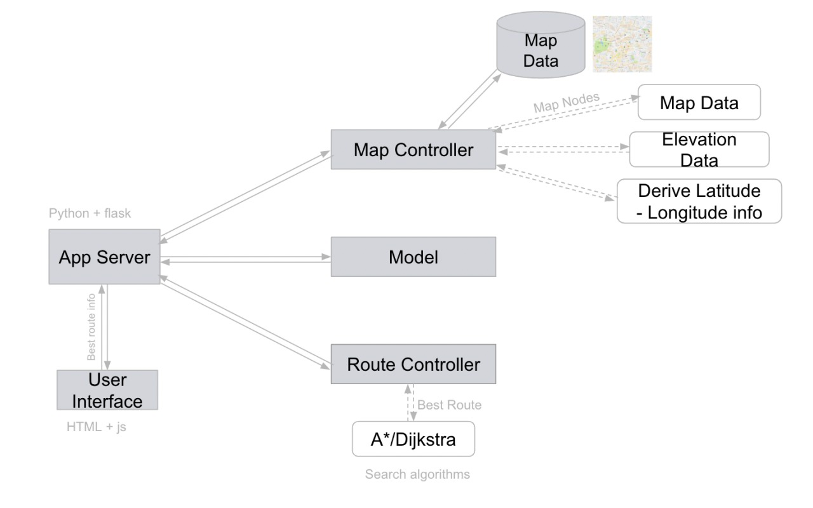

# 520_Squad4
# EleNA - Elevation Based Navigation System 
A navigational software program that maximizes or reduces the elevation gain and keeps the total distance between the two points to x% of the length of the shortest path.
The application allows runners and hikers to choose between simple and hard workouts based on their preferences.

# Design diagram


# Pre-reqs
### Installing the python modules for running the application
* In the Command line interface Run : **pip3 install -r requirements.txt**
* Make sure all the modules are installed properly and run the application from the root folder in the Chrome browser

### Running the Application -
* Execute ```run.sh``` to get the flask app started.
* Open the browser and go to `http://127.0.0.1:5000/view`.

### Testing the Application -
**We have added the all the unit test cases in src/test folder. Go to the src/test folder and run the test cases**

## Team Members
```
Poobigan Muragesan
Abhinava Maddha
Chandana Pamidi
Nihar Gupta Chinta
```

## Project Report
https://docs.google.com/document/d/1v31D8y-j9jdDquDFgZGJSjULomy8E7RQ5gyKRqPVgW0/edit


# video of Final Project Presentation
https://github.com/poobigan/520_Squad4/blob/main/docs/demo_Squad%204.mp4
